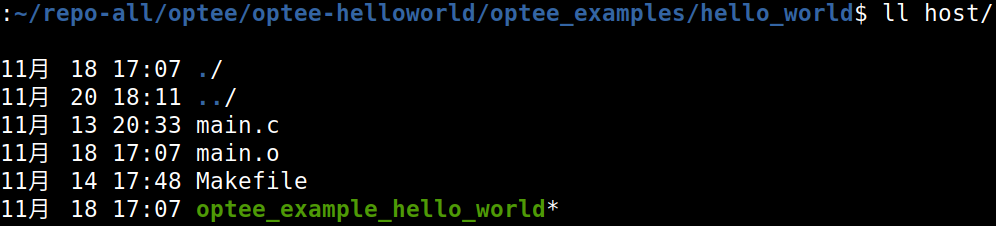
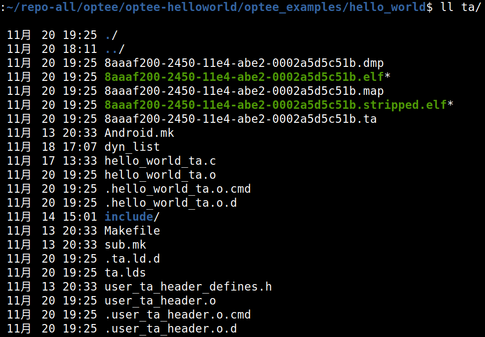
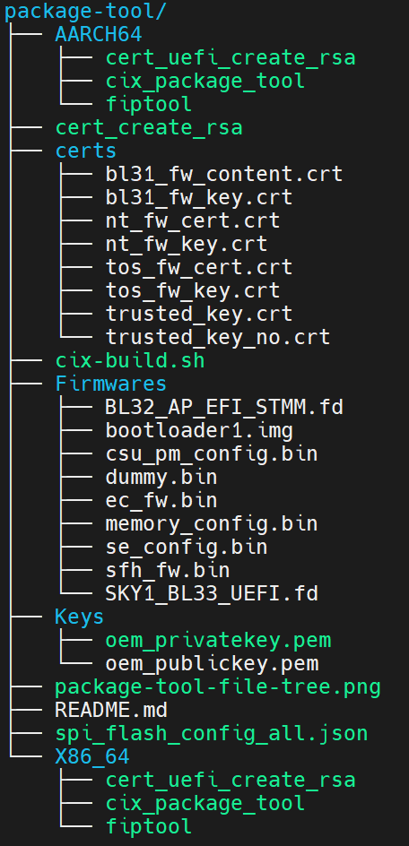

TF-A & TEE open source guide
==========================

Here is the package tool which will manage the source codes of tf-a and tee, and build them to generate the firmware images, package all images to a full flash image file (cix flash all bin).

The open-source TF-A and Optee released by CIX Technology have been tested on the Radxa O6 platform, with the software foundation being the open-source variant of the CIX P1 2025Q3 software release.
For implementation on alternative board-level platforms, it is advisable to utilize the original manufacturer’s 25Q3 software, with particular attention to the UEFI EDK2 component. The following files within the package tool require replacement:

    - Firmware/SKY1_BL33-UEFI.fd: Platform-dependent EDK2 component
    - Firmware/csu_pm_config.bin: Platform-dependent PMIC configuration data
    - Firmware/memory_config.bin: Platform-dependent DDR configuration data
    - Firmware/ec_fw.bin: Embedded Controller firmware (if present on the target platform)

**Note: Do not modify or replace other files in this package tool at will.**

Please follow next steps to generate the full flash image file (cix flash all bin)

# Fetch the package tool

[Click me](https://github.com/cixtech/cix_package-tool), you will goto and fetch [the package tool](https://github.com/cixtech/cix_package-tool)

The next commands will help you really:

    mkdir workspace
    cd workspace
    git clone https://github.com/cixtech/cix_package-tool -b cix_p1_k6.6_2025q3_tfa_open_dev

# Fetch the source codes of tf-a and tee
You may run the command to get the source codes of tf-a and tee if they are absent after you have owned the package tool.

    ./cix_package-tool/cix-build.sh -r

The source codes of tf-a and tee should present in the path ./bsp/ such as:

    ./bsp/tf-a
    ./bsp/tee

# Give out the toolchain to compile tf-a and tee
You should prepare the toolchain about arm elf ([download here](https://developer.arm.com/-/media/files/downloads/gnu-a/10.2-2020.11/binrel/gcc-arm-10.2-2020.11-x86_64-aarch64-none-elf.tar.xz?revision=79f65c42-1a1b-43f2-acb7-a795c8427085&rev=79f65c421a1b43f2acb7a795c8427085&hash=D1F7530466A8D7D3C25BA1D7D82C743C)) and give out the toolchain with -t < your toolchian path > to compile the source codes of tf-a and tee

    #build all and package to a full flash image file
    ./cix_package-tool/cix-build.sh -b -t ./tools/gcc/gcc-arm-10.2-2020.11-x86_64-aarch64-none-elf

    # or build the single module only
    ./cix_package-tool/cix-build.sh -b tf_a -t ./tools/gcc/gcc-arm-10.2-2020.11-x86_64-aarch64-none-elf
    ./cix_package-tool/cix-build.sh -b tee -t ./tools/gcc/gcc-arm-10.2-2020.11-x86_64-aarch64-none-elf

Maybe the default path ./tools/gcc/gcc-arm-10.2-2020.11-x86_64-aarch64-none-elf is nice to you that you will not care about the toolchain again later. build like this:

    #build all and package to a full flash image file
    ./cix_package-tool/cix-build.sh -b

    # or build the single module only
    ./cix_package-tool/cix-build.sh -b tf_a
    ./cix_package-tool/cix-build.sh -b tee
 
# Your built result files
You should find the built result files in directory ./output/ if all goes well.

| File                     | Description                                         |
| ------------------------ | --------------------------------------------------- |
| tf-a.bin                 | the tf-a firmware                                   |
| tee.bin                  | the tee firmware                                    |
| cix_flash_all.bin        | the flash image file with signature                 |

# About OEM Keys
**At present, we do not support using customers' own OEM keys. Please use the default key provided by CIX directly. CIX company is developing a KMS system, which is scheduled to be completed by the end of December 2025. By then, customers will be able to maintain their signature keys.**

**So please do not modify the files below temporarily:**

    ./Keys/oem_privatekye.pem
    ./Keys/oem_publickey.pem

# Helloworld(CA/TA Demo)
First step is to download toolchain, optee_client and optee_examples.

**1. toolchain**

    wget https://armkeil.blob.core.windows.net/developer/Files/downloads/gnu/12.3.rel1/binrel/arm-gnu-toolchain-12.3.rel1-x86_64-aarch64-none-linux-gnu.tar.xz

**2. optee_client**

Clone optee_client

    git clone https://github.com/OP-TEE/optee_client

Build

    cd optee_client/
    sed -i 's/WITH_TEEACL ?= 1/WITH_TEEACL ?= 0/g' Makefile
    make CROSS_COMPILE=<your-toolchain-path>/aarch64-linux-gnu-

**3. optee_examples**

Clone optee_examples

    git clone https://github.com/linaro-swg/optee_examples.git
Build

    cd optee_examples/hello_world
    make CROSS_COMPILE=<your-toolchain-path>/aarch64-linux-gnu- TA_DEV_KIT_DIR=<cix-build.sh-download-bsp-path>/bsp/tee/out/arm-plat-cix/export-ta_arm64 TEEC_EXPORT=<your-optee-client-download-path>/optee_client/out/export/usr/

**4. Examples**

    ll ./host

    ll ./ta

# Appendix
Here you will get the detail knowledge about the package tool. You may visit the path ./cix_package-tool.

    tree ./cix_package-tool

Every file has its description:

| File                          | Description                                                                     |
| ----------------------------- | ------------------------------------------------------------------------------- |
| cix-build.sh                  | the script which can build tf-a and tee, and package them to a flash image file |
| spi_flash_config_all.json     | define the layout structure of the image file format in flash                   |
| certs/bl31_fw_content.crt     | the certificate file for tf-a FIP image format                                  |
| certs/bl31_fw_key.crt         | the certificate file for tf-a FIP image format                                  |
| certs/nt_fw_cert.crt          | the certificate file for tf-a FIP image format                                  |
| certs/nt_fw_key.crt           | the certificate file for tf-a FIP image format                                  |
| certs/tos_fw_cert.crt         | the certificate file for tf-a FIP image format                                  |
| certs/tos_fw_key.crt          | the certificate file for tf-a FIP image format                                  |
| certs/trusted_key.crt         | the certificate file for tf-a FIP image format                                  |
| certs/trusted_key_no.crt      | the certificate file for tf-a FIP image format                                  |
| Firmwares/BL32_AP_EFI_STMM.fd | the uefi stMM image                                                             |
| Firmwares/bootloader1.img     | the bootloader1 firmware image from cix                                         |
| Firmwares/csu_pm_config.bin   | the PM(power management) config                                                 |
| Firmwares/dummy.bin           | the dummy file for build                                                        |
| Firmwares/ec_fw.bin           | the EC firmware from cix                                                        |
| Firmwares/memory_config.bin   | the DDR memory config from cix                                                  |
| Firmwares/se_config.bin       | the SE config from cix                                                          |
| Firmwares/sfh_fw.bin          | the sensor fusion firmware from cix                                             |
| Firmwares/SKY1_BL33_UEFI.fd   | the uefi firmware from cix                                                      |
| X86_64/cert_uefi_create_rsa   | create the uefi certificate file on x86 host                                    |
| X86_64/cix_package_tool       | the real package tool on x86 host which can package to the flash bios image     |
| X86_64/fiptool                | the fip tool which can package to bootloader2 and bootloader3(UEFI) on x86 host |
| AARCH64/cert_uefi_create_rsa  | create the uefi certificate file on arm host                                    |
| AARCH64/cix_package_tool      | the real package tool on arm host which can package to the flash bios image     |
| AARCH64/fiptool               | the fip tool which can package to bootloader2 and bootloader3(UEFI) on arm host |
| Keys/oem_privatekey.pem       | the reference OEM private key                                                   |
| Keys/oem_publickey.pem        | the reference OEM public key                                                    |

